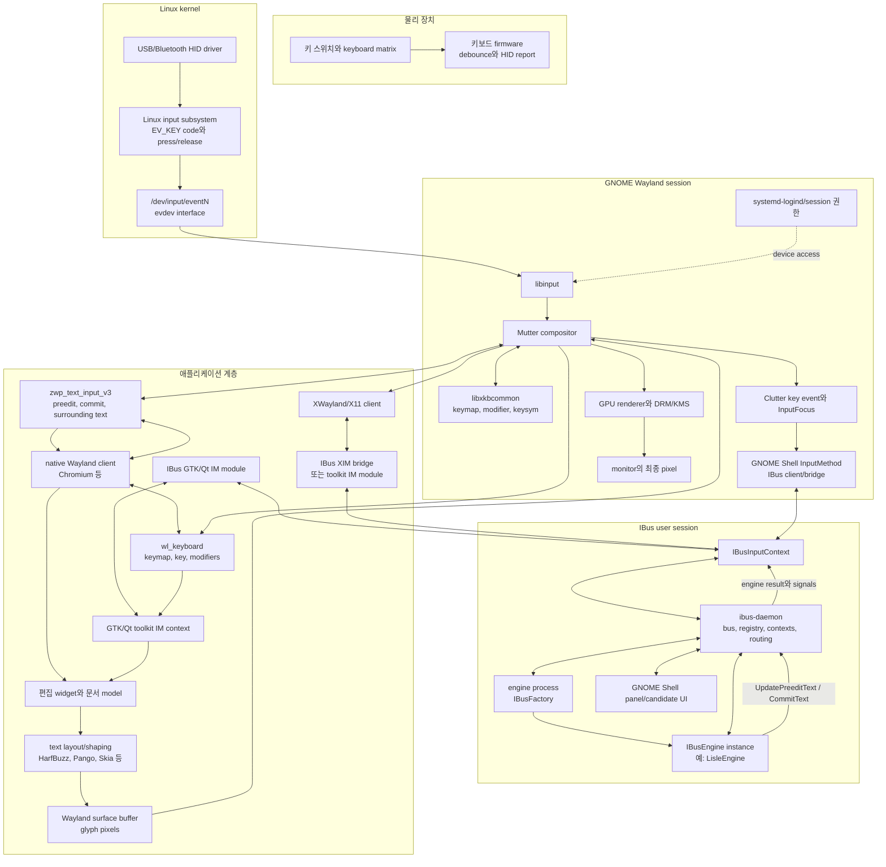
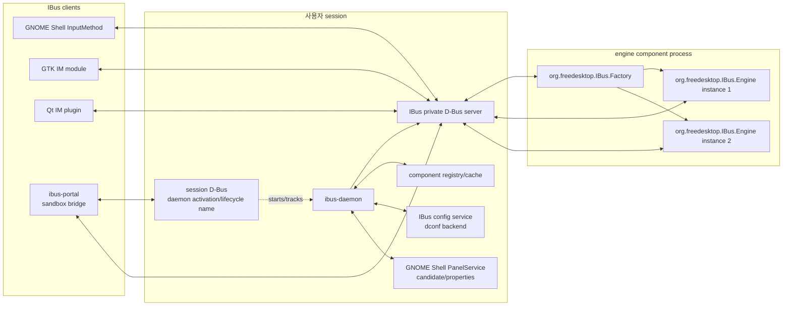
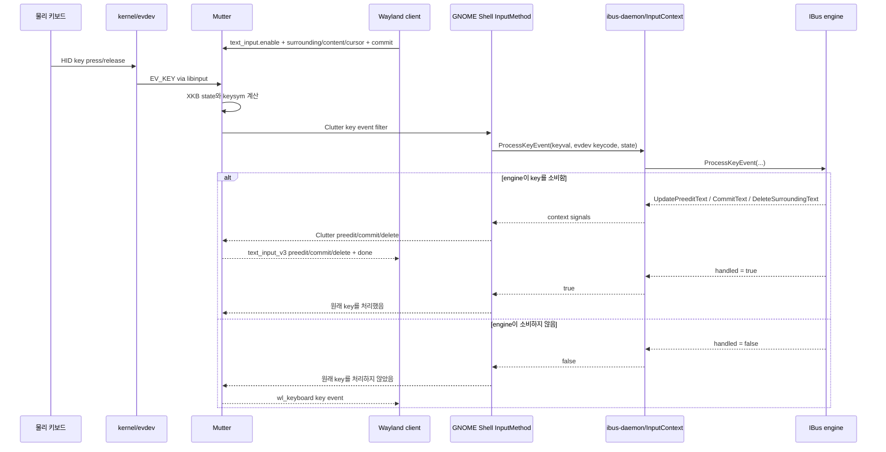
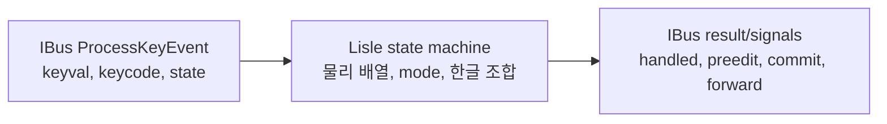

# IBus domain map

## 1. 문서의 목적과 기준 환경

이 문서는 물리 키보드에서 시작한 입력이 Linux 커널, GNOME/Mutter, Wayland,
IBus, 입력기 engine을 거쳐 애플리케이션의 편집 버퍼에 반영되기까지의 전체 계층을
설명한다. IBus가 아닌 입력기 framework는 비교 대상으로 다루지 않는다.

설명의 기준은 다음과 같다.

- Linux input subsystem과 evdev
- GNOME 50 / Mutter 50의 Wayland session
- IBus 1.5.x
- native Wayland client, 특히 Lisle이 검증하는 Chromium `text-input-v3` 경로
- GTK/Qt의 client-side IBus IM module과 XWayland 경로
- NixOS와 Home Manager에서의 패키징 및 session 통합

버전별 구현 세부사항과 protocol의 안정성은 달라질 수 있다. 특히
`zwp_text_input_v3`는 이름 그대로 아직 unstable protocol이다. 이 문서에서
"현재 GNOME"이라고 한 부분은 위 기준 환경을 뜻한다.

## 2. 먼저 구분해야 하는 세 개의 흐름

IBus 통합은 하나의 직선이 아니다. 다음 세 흐름이 맞물린다.

1. **입력/출력 data path**
   물리 key event가 engine까지 갔다가 preedit, commit 또는 처리하지 않은 key로
   애플리케이션에 돌아오는 경로다.
2. **control path**
   사용 가능한 engine을 발견하고, GNOME 입력 소스에 노출하고, 현재 engine을
   선택하며, focus와 engine instance의 생명주기를 관리하는 경로다.
3. **deployment path**
   IBus, engine, component XML, D-Bus service, systemd user unit, schema와 환경 변수를
   한 session에서 서로 맞는 버전과 경로로 제공하는 계층이다. Nix에서는
   `ibus-with-plugins`가 이 경로의 핵심 조립 도구다.

data path가 맞더라도 control path에서 engine이 선택되지 않으면 입력되지 않는다.
패키지가 설치되어 있어도 deployment path에서 component XML을 daemon이 찾지
못하면 control path에 engine 자체가 나타나지 않는다.

## 3. 전체 지도



그림의 모든 화살표가 한 key에 동시에 사용되는 것은 아니다. native Wayland
application이 compositor-mediated `text-input-v3`를 사용하는 경로와, GTK/Qt IM
module이 직접 IBus client가 되는 경로는 별도 client integration 방식이다.

## 4. 물리 키보드에서 evdev까지

### 4.1 키보드 장치

물리 키보드의 controller는 switch matrix를 scan하고 debounce한 뒤 USB HID 또는
Bluetooth HID report를 만든다. 이 단계의 값은 아직 문자 `a`나 `한`이 아니다.
대체로 어느 물리 usage가 눌리고 놓였는지를 표현한다.

### 4.2 kernel HID와 input subsystem

Linux HID driver는 장치 report를 Linux input event로 번역한다. keyboard key는
일반적으로 다음 정보가 된다.

- event type: `EV_KEY`
- event code: `KEY_A`, `KEY_LEFTSHIFT` 같은 Linux input code
- value: release, press 또는 repeat 상태
- event 묶음의 경계: `EV_SYN`

이 event는 `/dev/input/eventN`이라는 evdev 장치를 통해 userspace에 제공된다.
evdev는 Linux input subsystem의 일반 event interface다. 이 계층은 "어느 key가
눌렸는가"를 제공할 뿐 최종 Unicode text를 만들지 않는다.

참고: [Linux input event codes](https://docs.kernel.org/input/event-codes.html),
[Linux input subsystem](https://docs.kernel.org/input/input.html)

### 4.3 libinput과 session 권한

Wayland session에서는 일반 애플리케이션이 각자 `/dev/input/eventN`을 읽지 않는다.
compositor인 Mutter가 libinput을 통해 장치를 소유한다. libinput device와 evdev
device node는 기본적으로 1:1로 대응한다. 실제 device 접근 권한은 seat/session과
연계된 logind가 compositor에 제공한다.

이 경계가 중요한 이유는 다음과 같다.

- 모든 application이 다른 application의 key를 엿보지 못한다.
- compositor가 focus, global shortcut, accessibility, repeat 정책을 먼저 적용한다.
- IBus engine은 `/dev/input`을 열 필요가 없다.
- Lisle 같은 engine은 root, `input` group, `uinput` 권한이 필요하지 않다.

참고: [libinput architecture](https://wayland.freedesktop.org/libinput/doc/latest/architecture.html)

## 5. Mutter와 XKB 계층

Mutter는 libinput의 evdev keycode를 받아 libxkbcommon으로 keyboard state를
관리한다. XKB는 다음을 결합한다.

- 현재 keymap과 layout
- depressed, latched, locked modifier
- 현재 layout group
- keycode에 대응하는 keysym

여기서 반드시 구분해야 할 값은 다음과 같다.

| 값 | 의미 | 예시 |
|---|---|---|
| HID usage/scancode | 장치가 보고한 물리 usage | USB HID Keyboard A usage |
| Linux input code | kernel evdev의 물리 key 식별자 | `KEY_A` |
| XKB keycode | XKB keymap 안의 key 번호 | evdev 번호에 역사적 offset이 붙을 수 있음 |
| keysym/keyval | layout과 modifier를 적용한 논리 symbol | `a`, `A`, `Greek_alpha`, `Left` |
| Unicode text | application 문서에 들어가는 문자열 | `a`, `가`, `你好` |

keysym은 최종 text와 같지 않다. dead key, compose, 한글 조합, 후보 선택 같은
입력은 여러 key event에서 하나 이상의 Unicode string을 만들 수 있다.

현재 GNOME Shell bridge는 Clutter의 XKB keycode에서 8을 빼 IBus의
`ProcessKeyEvent`에 evdev-style `keycode`로 전달한다. 반대로 IBus
`ForwardKeyEvent`를 Clutter event로 되돌릴 때는 8을 더한다. Lisle이 물리 위치를
판별할 때 받는 `keycode`가 이 값이다.

참고: [libxkbcommon keyboard state](https://xkbcommon.org/doc/current/group__state.html),
[keycode와 keysym](https://xkbcommon.org/doc/current/keymap-text-format-v1-v2.html)

## 6. Wayland에는 key channel과 text channel이 따로 있다

### 6.1 `wl_keyboard`: key event 전달

core Wayland의 `wl_keyboard`는 compositor가 focused client에 다음을 전달하는
channel이다.

- XKB keymap
- keyboard enter/leave
- key press/release
- modifier state
- repeat 정보

이 channel의 중심 단위는 key다. application shortcut, navigation, 게임 조작처럼
문자가 아닌 입력도 이 channel을 사용한다.

### 6.2 `zwp_text_input_v3`: 편집 문맥과 text 전달

`text-input-v3`는 editable field와 compositor 사이의 별도 protocol이다.

client에서 compositor로 가는 상태:

- `enable` / `disable`
- surrounding text와 cursor/anchor
- content purpose와 hint: 일반 text, password, 숫자, URL 등
- cursor rectangle
- 위 변경을 한 batch로 적용하는 `commit` request

compositor에서 client로 가는 결과:

- `preedit_string`
- `commit_string`
- `delete_surrounding_text`
- 한 batch의 적용 경계인 `done`

따라서 "key가 application에 전달된다"와 "입력기가 만든 text가 application에
반영된다"는 다른 protocol 사건이다. engine이 key를 소비하면 원래 `wl_keyboard`
key는 일반 application 처리로 내려가지 않을 수 있고, 대신 `text-input-v3`의
preedit/commit이 내려간다. engine이 소비하지 않으면 원래 key event가 client로
전달된다.

참고: [Wayland text-input-v3 protocol](https://wayland.app/protocols/text-input-unstable-v3),
[core `wl_keyboard` protocol](https://wayland.app/protocols/wayland#wl_keyboard)

## 7. GNOME/Mutter가 Wayland와 IBus를 연결하는 방법

현재 GNOME Shell의 `InputMethod`는 `Clutter.InputMethod` 구현인 동시에 IBus
client다. 시작할 때 `gnome-shell`이라는 IBus input context를 만들고 다음을
연결한다.

- Clutter key event → `IBusInputContext.ProcessKeyEvent`
- IBus `CommitText` → Clutter/Mutter commit
- IBus `UpdatePreeditText` → Clutter/Mutter preedit
- IBus `DeleteSurroundingText` → focused Wayland text input
- IBus `ForwardKeyEvent` → Clutter key event 재전달
- Wayland focus/content type/cursor/surrounding text → IBus input context

Mutter의 Wayland text-input 구현은 `ClutterInputFocus`를 통해 GNOME Shell
`InputMethod`와 연결된다. engine 결과는 다시 `preedit_string`, `commit_string`,
`delete_surrounding_text`, `done` event로 Wayland client에 전달된다.

GNOME Shell bridge가 내보내는 IBus capability에는 preedit, focus, 지원되는 경우
surrounding text와 on-screen keyboard가 포함된다. password purpose 같은 보안 문맥은
GNOME이 IBus를 일시적으로 우회하거나 제한할 수 있으므로 모든 focused field가 항상
engine에 같은 정보를 제공한다고 가정해서는 안 된다.

참고:

- [GNOME Shell IBus–Clutter bridge](https://github.com/GNOME/gnome-shell/blob/dcda6594b153aa179d92cc62e2414d84a43ab82c/js/misc/inputMethod.js)
- [Mutter Wayland text input](https://gitlab.gnome.org/GNOME/mutter/-/blob/50.2/src/wayland/meta-wayland-text-input.c)
- [Mutter Clutter input focus](https://gitlab.gnome.org/GNOME/mutter/-/blob/50.2/clutter/clutter/clutter-input-focus.c)

## 8. 애플리케이션 종류에 따른 IBus 진입 경로

IBus를 사용한다는 말은 모든 application이 같은 transport를 사용한다는 뜻이
아니다.

| client 종류 | key가 IBus로 들어가는 곳 | preedit/commit이 돌아오는 곳 |
|---|---|---|
| native Wayland + `text-input-v3` | Mutter/GNOME Shell의 compositor-side input method | Mutter가 Wayland `preedit_string`/`commit_string`으로 client에 전달 |
| GTK application의 client-side IM | `GtkIMContext`의 IBus IM module | GTK signal로 focused widget에 적용 |
| Qt application의 client-side IM | Qt platform input context의 IBus plugin | Qt input method event로 widget에 적용 |
| XWayland/X11 | toolkit IBus module 또는 IBus XIM bridge | toolkit event 또는 XIM protocol로 적용 |

현재 Lisle의 대표 검증 경로는 첫 번째다.

```text
Chromium native Wayland
  ↔ zwp_text_input_v3
  ↔ Mutter ClutterInputFocus
  ↔ GNOME Shell InputMethod
  ↔ IBusInputContext
  ↔ ibus-daemon
  ↔ Lisle engine
```

GTK/Qt 경로에서는 Mutter가 `wl_keyboard` key를 client에 전달한 뒤 toolkit IM
context가 먼저 filter한다. IBus가 처리했다고 응답하면 일반 widget key handler로
넘기지 않고 preedit/commit을 적용한다. 처리하지 않았다고 응답하면 toolkit이 원래
key를 계속 처리한다.

`GTK_IM_MODULE=ibus`, `QT_IM_MODULE=ibus`, `XMODIFIERS=@im=ibus`는 이 client-side
경로들을 선택하는 session 변수다. `XMODIFIERS`는 특히 XIM/X11 계층에 관계한다.
Wayland session이라고 해서 이 변수들이 모두 무의미해지는 것은 아니며, 어떤
application integration을 사용하는지에 따라 필요성이 다르다.

IBus의 GTK client 구현 자체도 IM module, Qt module, X11 bridge와 Wayland
compositor를 모두 "IBus client"로 보고, event owner와 daemon 사이에서
`ProcessKeyEvent`를 중계한다고 설명한다.

참고: [IBus GTK IM context](https://github.com/ibus/ibus/blob/1.5.33/client/gtk2/ibusimcontext.c)

### 8.1 application의 편집 model에서 화면까지

IBus가 돌려준 commit string은 focused widget의 편집 model에 Unicode text로
삽입된다. preedit은 보통 별도의 composition range로 유지되어 밑줄, 선택 범위 또는
cursor와 함께 임시 표시된다. 이 단계에서 application은 undo, selection, cursor
이동과 accessibility event를 자기 정책에 맞게 처리한다.

그 뒤 text layout/shaping 계층이 Unicode codepoint sequence, font, script와 language
정보를 glyph ID와 위치로 바꾼다. GTK 계열에서는 Pango/HarfBuzz, Chromium에서는
Blink/Skia/HarfBuzz 같은 조합이 이 역할을 맡을 수 있다. renderer는 glyph를 Wayland
surface buffer의 pixel로 만들고 surface를 commit한다. Mutter는 그 buffer를 다른
surface와 합성해 monitor에 표시한다.

즉 IBus는 glyph를 그리지 않는다. IBus의 마지막 책임은 text와 composition 상태를
focused client까지 전달하는 것이고, font 선택·shaping·rasterization·화면 합성은
application/toolkit과 compositor의 출력 pipeline이다.

## 9. IBus의 process와 object model



### 9.1 `ibus-daemon`

daemon은 다음을 소유한다.

- IBus private message bus
- component/engine registry와 cache
- client별 `IBusInputContext`
- 현재 engine 선택과 context–engine routing
- engine component process의 시작과 종료
- config와 panel service의 연결

daemon은 자신의 lifecycle을 외부에서 추적하고 시작할 수 있도록 session D-Bus의
`org.freedesktop.IBus` 이름도 소유하지만, 일반 IBus client와 engine의 주 통신은
daemon이 만든 private D-Bus server를 사용한다. address는 runtime address file이나
환경을 통해 client에 알려진다.

Flatpak 같은 sandbox client는 private bus에 직접 접근하지 못할 수 있다.
`ibus-portal`은 session bus의 `org.freedesktop.portal.IBus`를 통해 제한된 proxy
input context를 만들고 실제 IBus context로 중계한다.

### 9.2 `IBusInputContext`

input context는 client와 현재 engine 사이의 논리적 편집 문맥이다. 주요 책임은
다음과 같다.

- focus in/out
- key event 처리 요청
- surrounding text, cursor rectangle, content type 전달
- reset, enable, disable
- preedit, commit, surrounding deletion과 forwarded key 수신

GNOME Shell은 하나의 compositor-side context를 만들고 Wayland focus 변화를 그
context에 반영한다. client-side GTK/Qt integration은 application 또는 widget
생명주기에 맞춰 별도 context를 만들 수 있다. 따라서 "창 하나 = engine 하나"처럼
고정해서 생각해서는 안 된다.

참고: [IBusBus와 input context 생성](https://ibus.github.io/docs/ibus-1.5/IBusBus.html),
[IBusInputContext](https://ibus.github.io/docs/ibus-1.5/IBusInputContext.html)

### 9.3 component, factory와 engine instance

engine package는 `share/ibus/component/*.xml` descriptor를 제공한다. descriptor에는
대체로 다음이 들어간다.

- component D-Bus name
- component process를 시작할 command
- 제공하는 engine ID
- 표시 이름, 언어, icon, rank
- engine과 함께 적용할 XKB layout/variant

daemon이 engine을 필요로 하면 component process를 시작하고
`org.freedesktop.IBus.Factory.CreateEngine`을 호출한다. factory는 context에 연결할
`org.freedesktop.IBus.Engine` object path를 돌려준다. 하나의 component process가
여러 engine 종류나 여러 engine instance를 제공할 수 있다.

Lisle은 다음 구조다.

```text
lisle.xml
  ├── component name: org.freedesktop.IBus.Lisle
  ├── exec: ibus-engine-lisle --ibus
  └── engine id: lisle

ibus-engine-lisle process
  ├── /org/freedesktop/IBus/Factory
  └── /org/freedesktop/IBus/Engine/N
```

참고: [IBus component XML](https://github.com/ibus/ibus/wiki/DevXML),
[IBusFactory](https://ibus.github.io/docs/ibus-1.5/IBusFactory.html),
[IBusEngine](https://ibus.github.io/docs/ibus-1.5/IBusEngine.html)

### 9.4 panel과 candidate UI

engine은 lookup table, auxiliary text, property와 candidate 관련 signal을 낼 수 있다.
GNOME에서는 GNOME Shell이 IBus panel service 이름을 소유하고 candidate popup과
입력기 property UI를 표시한다. engine이 직접 application window 위에 candidate
창을 그리는 구조로 가정해서는 안 된다.

Lisle은 현재 candidate나 lookup table을 사용하지 않지만, IBus domain에는 이
계층이 존재한다.

## 10. 한 key를 처리하는 상세 sequence

다음은 Lisle이 검증하는 native Wayland `text-input-v3` 경로다.



실제 signal과 method 호출은 비동기일 수 있다. 핵심 불변조건은 하나의 key를 engine이
소비했는지 여부가 원래 key를 application에 계속 보낼지 결정한다는 점이다.
engine이 `ForwardKeyEvent`를 별도로 보낸 경우에는 원래 event를 처리하지 않았다는
응답과 중복하여 application에 두 번 보내지 않도록 주의해야 한다.

`ProcessKeyEvent`에는 process 간 round trip이 있으므로 latency와 ordering도
protocol의 일부다. 현재 GNOME Shell bridge는 asynchronous call을 사용하고 응답이
올 때 Clutter에 handled 여부를 통지한다. IBus의 GTK/XIM client는
`IBUS_ENABLE_SYNC_MODE`에 따라 synchronous, asynchronous 또는 hybrid 방식으로
event owner와 daemon 사이의 기다림/replay 정책을 바꿀 수 있다. 어느 방식이든
engine은 key 처리 중 main loop를 오래 막지 않아야 하며, client는 응답 전에 원래
event와 합성 event를 임의로 중복 전달해서는 안 된다.

## 11. IBus event와 text vocabulary

### 11.1 `ProcessKeyEvent(keyval, keycode, state)`

- `keyval`: XKB keysym에 해당하는 논리 symbol
- `keycode`: IBus가 기대하는 evdev-style physical code
- `state`: modifier mask와 release 등의 IBus flag
- 반환값 `true`: engine이 처리했으므로 일반 key 처리로 넘기지 않음
- 반환값 `false`: client/compositor가 원래 key를 계속 처리할 수 있음

engine에 따라 keyval 중심으로 해석할 수도 있고, keycode 중심으로 해석할 수도 있다.
Lisle은 한글/로마자 배열을 물리 위치에 고정하기 위해 text mapping에는 keycode를
중심으로 사용하고, host shortcut과 XKB layout의 의미는 별도로 보존한다.

### 11.2 preedit

아직 application 문서에 확정되지 않은 조합 문자열이다. application은 cursor
위치에 임시로 표시하지만 undo buffer나 영구 문서 text로 취급해서는 안 된다.
새 preedit은 이전 preedit을 대체한다.

### 11.3 commit

Unicode string을 application의 현재 편집 위치에 확정한다. 한 key가 여러 codepoint를
commit할 수도 있고, 여러 key가 하나의 commit을 만들 수도 있다.

### 11.4 surrounding text와 delete surrounding

예측, 재변환, 문맥 기반 처리에 필요한 cursor 주변의 이미 확정된 text다. engine은
client가 capability를 제공한 범위에서만 사용해야 한다. password나 sensitive field는
제공하지 않거나 제한할 수 있다.

### 11.5 forward key

engine이 원래 key를 직접 다시 host에 보내야 하는 경우 사용하는 경로다. 이것은
kernel input injection이 아니다. IBus client/compositor가 자기 event 계층에 다시
전달하는 합성 event다. 따라서 원래 hardware event의 모든 부가 정보가 완벽히
보존된다고 가정해서는 안 된다.

## 12. engine 발견, 노출, 선택, 실행은 서로 다른 상태다

IBus 문제를 진단할 때 가장 유용한 구분이다.

| 상태 | 의미 | 대표 확인 대상 |
|---|---|---|
| package가 존재함 | 실행 파일과 XML이 Nix store/profile에 있음 | package output |
| discoverable | 실행 중인 daemon의 registry가 component XML을 읽음 | `IBUS_COMPONENT_PATH`, registry cache, `ibus list-engine` |
| GNOME source에 노출됨 | GNOME 입력 소스 목록에 engine ID가 있음 | `org.gnome.desktop.input-sources sources` |
| selected | 현재 GNOME input source/IBus global engine으로 선택됨 | Shell indicator, `ibus engine` |
| component process가 실행됨 | daemon이 descriptor의 command를 시작함 | user process와 D-Bus name |
| engine instance가 active/focused | input context에 instance가 연결되어 focus와 enable을 받음 | IBus lifecycle callbacks |

예를 들어 `lisle.xml`이 store에 있는 것만으로는 discoverable하지 않을 수 있다.
discoverable해도 GNOME source 목록에 없으면 UI에서 선택하기 어렵다. 선택되어도 focused
editable field가 `text-input-v3`나 toolkit IM context를 enable하지 않으면 key가
engine까지 오지 않는다.

## 13. GNOME 입력 소스 control plane

GNOME의 입력 소스 목록은 dconf의 다음 key로 관리된다.

```text
org.gnome.desktop.input-sources sources
```

예:

```text
[('ibus', 'lisle'), ('xkb', 'us')]
```

첫 tuple 값은 source 종류, 두 번째 값은 IBus engine ID 또는 XKB source ID다.
GNOME Shell의 input source manager는 이 목록과 IBus가 보고한 engine descriptor를
합쳐 indicator와 전환 popup을 만든다.

source가 선택되면 GNOME Shell은 다음을 함께 수행한다.

1. source가 요구하는 XKB layout을 Mutter에 적용한다.
2. IBus source라면 해당 engine ID를 IBus에 선택한다.
3. MRU/per-window source 상태와 panel 표시를 갱신한다.

XKB source도 GNOME 내부에서는 `xkb:<layout>:<variant>:<language>` 형태의 IBus
engine으로 연결될 수 있다. 따라서 GNOME 입력 소스 UI에서 XKB와 IBus가 나란히
보이더라도 daemon/engine control path에서는 서로 연동된다.

참고: [GNOME Shell input source manager](https://github.com/GNOME/gnome-shell/blob/dcda6594b153aa179d92cc62e2414d84a43ab82c/js/ui/status/keyboard.js)

IBus 자체 설정의 `/desktop/ibus/...` dconf schema와 GNOME의
`/org/gnome/desktop/input-sources/...`는 다른 namespace다. 전자는 IBus hotkey,
engine order, panel과 engine 설정 등에 쓰이고, 후자는 GNOME desktop의 source
목록과 전환 정책에 쓰인다.

참고: [IBus dconf schema](https://github.com/ibus/ibus/blob/1.5.33/data/dconf/org.freedesktop.ibus.gschema.xml)

## 14. session 시작과 service 계층

GNOME session에서 IBus가 동작하려면 다음 요소가 서로 맞아야 한다.

### 14.1 systemd user unit

`org.freedesktop.IBus.session.GNOME.service`가 GNOME session target과 함께
`ibus-daemon`을 시작한다. unit은 session D-Bus 이름
`org.freedesktop.IBus`를 소유하는 process를 기대한다.

### 14.2 D-Bus activation

`org.freedesktop.IBus.service`는 daemon이 아직 없을 때 session D-Bus activation으로
시작할 fallback을 제공한다. GNOME의 정상 startup은 GNOME용 systemd unit이 주 경로다.

### 14.3 dconf와 GSettings schema

IBus config backend와 GNOME source 설정을 읽으려면 dconf service와 schema가
session에서 보여야 한다. `dconf.enable`은 engine 발견과 별개지만, 빠지면 설정
읽기/쓰기가 실패할 수 있다.

### 14.4 portal

Flatpak 등 sandboxed IBus client를 지원하려면 `org.freedesktop.portal.IBus` D-Bus
service와 `ibus-portal`이 보여야 한다. portal은 engine을 구현하는 것이 아니라
sandbox client의 input context 요청을 실제 IBus bus로 proxy한다.

### 14.5 session environment

client-side GTK/Qt/XIM integration을 사용할 때는 다음 환경이 중요하다.

```text
GTK_IM_MODULE=ibus
QT_IM_MODULE=ibus
XMODIFIERS=@im=ibus
```

Wayland compositor-mediated `text-input-v3` 경로는 이 변수만으로 만들어지는 것이
아니다. client의 protocol 지원과 Mutter/GNOME Shell bridge가 필요하다.

## 15. Nix에서 `ibus-with-plugins`가 담당하는 계층

전통적인 배포판은 IBus와 모든 engine의 component XML을 공용
`/usr/share/ibus/component`에 설치한다. Nix에서는 각 package가 서로 다른 prefix를
가진다.

```text
/nix/store/...-ibus/share/ibus/component/
/nix/store/...-lisle/share/ibus/component/lisle.xml
/nix/store/...-ibus-hangul/share/ibus/component/hangul.xml
```

IBus registry는 `IBUS_COMPONENT_PATH`가 있으면 그 colon-separated directory만
scan하고, 없으면 compile-time IBus data directory만 scan한다. 사용자
`$XDG_DATA_HOME/ibus/component` 자동 scan은 upstream에서 비활성화되어 있다.
그러므로 engine을 `home.packages`에 따로 넣는 것만으로 daemon이 발견한다는 보장이
없다.

`ibus-with-plugins`는 다음 입력을 받는다.

```nix
pkgs.ibus-with-plugins.override {
  plugins = [ lisle pkgs.ibus-engines.hangul ];
}
```

그리고 다음을 만든다.

- IBus와 선택한 모든 engine의 `/bin`, `/lib`, `/libexec`, `/share` symlink union
- 모든 component XML이 보이는 단일 `share/ibus/component`
- `IBUS_COMPONENT_PATH`와 IBus data/table 경로를 aggregate로 설정한 wrapper
- registry를 다시 읽도록 `--cache=refresh`가 붙은 `ibus-daemon`
- aggregate wrapper를 실행하도록 고친 D-Bus service와 GNOME/generic systemd unit

즉 이것은 **engine manager가 아니라 재현 가능한 IBus runtime aggregate
package**다.

참고:

- [nixpkgs `ibus-with-plugins`](https://github.com/NixOS/nixpkgs/blob/d407951447dcd00442e97087bf374aad70c04cea/pkgs/by-name/ib/ibus-with-plugins/package.nix)
- [IBus registry discovery](https://github.com/ibus/ibus/blob/1.5.33/src/ibusregistry.c#L251-L289)
- [NixOS IBus module](https://github.com/NixOS/nixpkgs/blob/d407951447dcd00442e97087bf374aad70c04cea/nixos/modules/i18n/input-method/ibus.nix)

### 15.1 `ibus-with-plugins`가 하지 않는 일

- daemon unit을 session에서 반드시 선택되게 만들지 않는다.
- GNOME source 목록에 engine을 추가하지 않는다.
- GTK/Qt/XIM session 변수를 선택하지 않는다.
- dconf, D-Bus, portal을 session에 등록하지 않는다.
- 나중에 profile에 따로 설치한 engine을 동적으로 수집하지 않는다.
- 서로 다른 두 aggregate의 engine 목록을 합치지 않는다.

실제로 실행된 daemon이 가리키는 aggregate 하나가 최종 engine universe가 된다.
따라서 모든 engine package는 IBus 수준에서 하나의 merge 가능한 목록으로 모은 뒤
aggregate 하나를 만들어야 한다.

## 16. 책임 경계

| 계층 | 소유해야 하는 것 | 소유해서는 안 되는 것 |
|---|---|---|
| kernel/input | hardware event와 evdev code | Unicode 조합 정책 |
| libinput/Mutter | 장치, seat, focus, XKB state, key routing | 특정 언어 engine의 조합 규칙 |
| Wayland text input | 편집 문맥 state와 preedit/commit transport | engine discovery와 package 설치 |
| GNOME Shell | 입력 소스 UI, IBus bridge, panel, source 전환 | Lisle 내부 한글 state machine |
| `ibus-daemon` | registry, context, engine routing/lifecycle | engine별 언어 규칙 |
| generic IBus module | daemon runtime, aggregate, service, D-Bus, env | 특정 engine이 다른 engine 목록을 소유하게 하는 것 |
| engine package/module | 자기 executable, XML, metadata와 engine 등록 기여 | IBus 전체 daemon과 다른 engine의 목록 |
| application/toolkit | focused widget, surrounding text, preedit 표시, commit 적용 | 전역 engine process lifecycle |

이 경계를 Home Manager option으로 옮기면 이상적인 구조는 다음과 같다.

```nix
programs.ibus = {
  enable = true;
  engines = [
    lisle
    pkgs.ibus-engines.hangul
    pkgs.ibus-engines.mozc
  ];
};
```

generic IBus module이 최종 `engines` 목록으로 aggregate와 session integration을
만들고, Lisle/Hangul/Mozc module은 각각 자기 package 하나만 그 목록에 기여한다.
engine끼리는 서로의 존재를 알 필요가 없다.

## 17. Lisle의 정확한 위치

Lisle은 다음만 책임지는 IBus engine이다.



Lisle은 다음을 직접 하지 않는다.

- evdev device 읽기
- Wayland connection 관리
- application document 직접 수정
- virtual keyboard/uinput으로 key 주입
- GNOME panel 그리기
- IBus daemon이나 다른 engine의 lifecycle 소유

Lisle이 보는 것은 compositor/toolkit이 IBus context를 통해 전달한 key event이고,
Lisle이 내보내는 것은 IBus method 반환값과 signal이다. GNOME/Mutter 또는 toolkit이
그 결과를 실제 focused application에 적용한다.

## 18. 장애를 계층별로 찾는 법

| 증상 | 먼저 볼 계층 |
|---|---|
| 어떤 key도 desktop에 오지 않음 | device, kernel, libinput, Mutter/session 권한 |
| 일반 영문 key는 오지만 engine 목록에 Lisle이 없음 | component XML, `IBUS_COMPONENT_PATH`, aggregate, registry cache |
| `ibus list-engine`에는 있지만 GNOME UI에 없음 | GNOME input sources dconf |
| GNOME UI에는 있지만 선택하면 daemon이 바뀌지 않음 | Shell input source manager, IBus connection, engine ID |
| 선택 시 Lisle process가 뜨지 않음 | component `<exec>`, D-Bus factory name, daemon log |
| GTK에서는 되고 Chromium Wayland에서는 안 됨 | client-side IM module과 compositor `text-input-v3` 경로 차이 |
| Chromium에서는 되고 특정 Qt app에서는 안 됨 | Qt IBus plugin, session variables, sandbox/portal |
| preedit은 보이지만 commit이 유실/중복됨 | engine signal 순서, Mutter batching, client protocol 구현 |
| shortcut이 두 번 실행됨 | handled 반환과 `ForwardKeyEvent` 중복 |
| 다른 engine을 추가했는데 보이지 않음 | 실제 daemon이 쓰는 aggregate의 최종 engine 목록 |
| 재로그인 뒤 다른 IBus가 실행됨 | systemd user unit 우선순위, D-Bus activation service 경로 |

## 19. 핵심 불변조건 요약

1. 물리 keycode, XKB keysym과 Unicode text는 다른 계층의 값이다.
2. Wayland의 key event channel과 text composition channel은 별개다.
3. IBus engine은 hardware device가 아니라 `IBusInputContext`에서 event를 받는다.
4. engine의 `handled` 결과와 explicit forward를 중복해서는 안 된다.
5. preedit은 임시 text이고 commit만 application 문서에 확정된다.
6. package 설치, daemon discovery, GNOME source 노출, 선택, active focus는 서로 다른
   상태다.
7. Nix에서는 실행 중인 daemon과 모든 engine이 같은 `ibus-with-plugins` aggregate를
   가리켜야 한다.
8. IBus 전체 lifecycle은 generic IBus 계층이 소유하고, 각 engine은 자기 package와
   engine 동작만 소유해야 한다.

## 20. 주요 upstream 자료

- [IBus source and overview](https://github.com/ibus/ibus)
- [IBus component XML](https://github.com/ibus/ibus/wiki/DevXML)
- [IBusBus](https://ibus.github.io/docs/ibus-1.5/IBusBus.html)
- [IBusInputContext](https://ibus.github.io/docs/ibus-1.5/IBusInputContext.html)
- [IBusFactory](https://ibus.github.io/docs/ibus-1.5/IBusFactory.html)
- [IBusEngine](https://ibus.github.io/docs/ibus-1.5/IBusEngine.html)
- [Linux input event codes](https://docs.kernel.org/input/event-codes.html)
- [libinput architecture](https://wayland.freedesktop.org/libinput/doc/latest/architecture.html)
- [libxkbcommon keyboard state](https://xkbcommon.org/doc/current/group__state.html)
- [Wayland text-input-v3](https://wayland.app/protocols/text-input-unstable-v3)
- [GNOME Shell IBus input method bridge](https://github.com/GNOME/gnome-shell/blob/dcda6594b153aa179d92cc62e2414d84a43ab82c/js/misc/inputMethod.js)
- [GNOME Shell input source manager](https://github.com/GNOME/gnome-shell/blob/dcda6594b153aa179d92cc62e2414d84a43ab82c/js/ui/status/keyboard.js)
- [Mutter Wayland text input](https://gitlab.gnome.org/GNOME/mutter/-/blob/50.2/src/wayland/meta-wayland-text-input.c)
- [nixpkgs `ibus-with-plugins`](https://github.com/NixOS/nixpkgs/blob/d407951447dcd00442e97087bf374aad70c04cea/pkgs/by-name/ib/ibus-with-plugins/package.nix)
